# README - Práctica M08 - Creación de una página web dinámica en PHP - vueloamenazado.local

---

### 👋 Para recruiters

Proyecto fullstack desarrollado como práctica de Grado Superior en DAW y posteriormente **mejorado y desplegado en producción** de forma autónoma.

**Stack:** PHP 8.2 · MySQL (Aiven) · Apache · Docker · Twig · Bootstrap · Chart.js · JWT · Render

**Destacado:**
- 🌐 **Desplegado en producción:** https://vueloamenazado-local.onrender.com
- 🔐 **API REST protegida** con autenticación JWT (POST/PATCH/DELETE requieren login)
- 🐳 **Dockerizado** con configuración personalizada de Apache para entorno cloud
- 🌍 **Internacionalización** español/inglés con sistema de cookies
- 📊 **Gráficas interactivas** con Chart.js
- ✅ **Nota original: 10/10** — mejorado posteriormente de forma independiente

> 📖 Este README documenta en detalle el stack técnico, las decisiones de arquitectura, las pruebas realizadas y el proceso completo de despliegue. Si quieres ver cómo resuelvo problemas reales, te recomiendo leerlo completo.

### 🔑 Acceso rápido a la demo

| Ruta | Descripción | Credenciales |
|---|---|---|
| [`/`](https://vueloamenazado-local.onrender.com/) | Página principal | — |
| [`/login`](https://vueloamenazado-local.onrender.com/login) | Inicio de sesión | Usuario: `user` · Contraseña: `user` |
| [`/register`](https://vueloamenazado-local.onrender.com/register) | Registro de nuevos usuarios | — |
| [`/admin`](https://vueloamenazado-local.onrender.com/admin) | Panel de administración | Requiere login |

> ⏱️ El servicio está en el plan gratuito de Render y "duerme" tras inactividad; la primera petición puede tardar ~30-50s.

---

## 🚀 Mejoras Post-Práctica

Este proyecto fue retomado después de obtener la nota final con el objetivo de llevarlo a producción y resolver problemas técnicos pendientes. A continuación se detallan las mejoras realizadas y lo aprendido en el proceso.

### 🌐 Primer despliegue en producción con Railway

El proyecto se desplegó inicialmente en [Railway](https://railway.app), una plataforma gratuita que soporta Docker y MySQL. Este proceso implicó:

- Configurar el `Dockerfile` existente para que Railway lo detectara correctamente.
- Resolver un conflicto de MPM en Apache (`mpm_event` vs `mpm_prefork`) que impedía arrancar el contenedor.
- Adaptar Apache para escuchar en el puerto dinámico que la plataforma inyecta via la variable de entorno `$PORT`.
- Crear un script de arranque (`docker-entrypoint.sh`) para aplicar la configuración en runtime.
- Cargar la base de datos MySQL en Railway mediante Docker y el cliente MySQL.
- Configurar variables de entorno para la conexión a la base de datos y el JWT.

> Tras acabar el periodo de prueba gratuito de Railway, el proyecto se migró a Render + Aiven (ver siguiente sección).

### 🔄 Migración a Render + Aiven

Al terminar el trial gratuito de Railway, se migró la app a **Render** (contenedor Docker) y la base de datos a **Aiven** (MySQL gestionado, tier gratuito permanente). Como la conexión a MySQL y el manejo de `$PORT` ya estaban parametrizados por variables de entorno, la migración de código fue mínima, pero surgieron problemas específicos del nuevo proveedor:

- **Timeout de conexión a MySQL**: la conexión PDO no especificaba puerto, así que siempre usaba el 3306 por defecto. Aiven expone MySQL en un puerto no estándar (asignado por servicio), así que las conexiones nunca llegaban a establecerse. Se añadió `DB_PORT` como variable de entorno configurable.
- **SSL obligatorio**: Aiven exige TLS en la conexión. Se añadió el certificado CA al proyecto y se configuró `PDO::MYSQL_ATTR_SSL_CA` para habilitarlo automáticamente cuando el certificado está presente.
- **Restricción de clave primaria al importar el dump**: Aiven exige `sql_require_primary_key` por defecto, y la tabla `Avistamientos` (relación muchos-a-muchos) no tenía primary key definida. Se desactivó la restricción a nivel de sesión únicamente durante la importación del dump.

**URL de producción:** https://vueloamenazado-local.onrender.com

### ⚡ Corrección de cuelgues en producción (llamadas HTTP internas)

Tras la migración, la página principal y el detalle de cada pájaro tardaban minutos en cargar o directamente no respondían. La causa no era el cold-start de Render, sino un problema de arquitectura:

- Varias vistas (`home.php`, `detallePajaro.php`) obtenían los datos de su propia API haciendo peticiones HTTP a sí mismas (`file_get_contents` contra `localhost`) en lugar de llamar directamente a los controladores PHP.
- La home, además, hacía esa llamada **una vez por cada pájaro** (265 peticiones HTTP secuenciales) solo para calcular las estadísticas de conservación.
- Con los pocos workers de Apache disponibles en el plan gratuito de Render, una petición podía agotar la capacidad del servidor esperando una respuesta de sí mismo, provocando cuelgues indefinidos.

**Solución:** sustituir las llamadas HTTP internas por llamadas directas a los controladores (mismo proceso, sin red), y agrupar en PHP los datos de conservación con una sola consulta en vez de 265. Tiempo de carga de la home: de un cuelgue indefinido a **~0.4s** en producción.

### 🔧 Corrección de errores en producción

Al desplegar, se detectaron errores que no eran visibles en local:

- **URLs hardcodeadas**: Todos los views usaban `http://www.vueloamenazado.local` como base para las llamadas a la API. En producción esto causaba timeouts de 15 segundos y errores 502. Se corrigieron para usar `http://localhost:$PORT` dinámicamente.
- **Bootstrap local**: Los templates cargaban Bootstrap desde una ruta local (`/public/assets/`) que no existía en producción. Se migró a CDN.
- **Parámetros de URL perdidos**: Al cambiar de idioma, parámetros como `letra` y el tipo de gráfico seleccionado se perdían. Se corrigió conservándolos en la redirección.

### 🔐 Seguridad de la API

Se resolvió el problema pendiente de proteger los endpoints de escritura de la API REST:

- Los métodos POST, PATCH y DELETE ahora requieren autenticación.
- Se usa el JWT almacenado en sesión para verificar la identidad del usuario en llamadas servidor-a-servidor, ya que las cookies del navegador no se propagan en llamadas internas PHP.
- Los endpoints GET siguen siendo públicos para permitir la carga de datos sin autenticación.

### 🍪 Sistema de idioma mejorado

El cambio de idioma se gestionaba mediante `?lang=` en la URL, lo que exponía el parámetro permanentemente. Se mejoró para:

- Guardar el idioma seleccionado en una cookie con duración de 30 días.
- Redirigir tras el cambio para limpiar la URL.
- Conservar otros parámetros activos (filtro de letra, tipo de gráfico) durante la redirección.

### ✨ Mejoras de UX

- Botón de "subir al inicio" añadido en todos los templates.
- El tipo de gráfico (circular/barras) se mantiene al cambiar de idioma o aplicar filtros.

### 📚 Lo aprendido

- Por qué la seguridad de la API no funcionaba originalmente: las llamadas internas PHP no envían cookies del navegador, por lo que la verificación basada en cookies siempre fallaba.
- La importancia de gestionar el estado del usuario (selecciones, preferencias) en cookies o sesión para que persista entre navegaciones.
- El proceso completo de despliegue a producción: desde Docker hasta resolución de errores específicos de cada proveedor cloud.
- La diferencia entre errores visibles solo en producción (URLs hardcodeadas, puertos dinámicos) y errores detectables en local.
- Que parametrizar host/puerto/credenciales de la base de datos desde el primer día hace que migrar de proveedor (Railway → Render + Aiven) sea un cambio de configuración, no de código.
- Que una app nunca debería hacerse peticiones HTTP a sí misma para obtener sus propios datos: además del coste de red innecesario, puede agotar los workers del servidor y colgarlo por completo bajo recursos limitados.

---

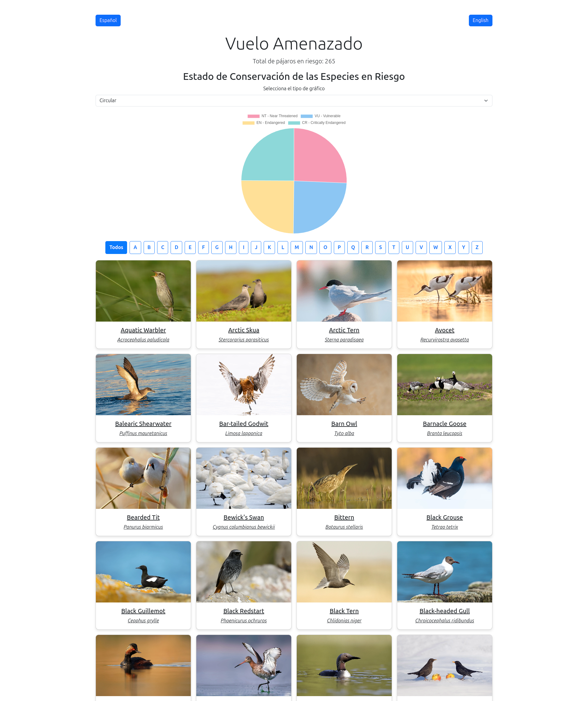

Esta práctica consiste en una **página web dinámica en PHP** la cual extrae los datos de [www.rspb.org.uk](https://www.rspb.org.uk) utilizando scraping con Selenium. [Link al proyecto: wselenium](https://github.com/Fernandodg97/wselenium). 

Dispone de un frontal que nos permite visualizar todos los pájaros, una segunda página que nos permite visualizar la información de estos. También dispone de una página para iniciar sesión y un panel de administración. 

Entre sus funcionalidades destacan:

- Traducción al inglés.
- Gráfica circular o de barras para mostrar los estados de conservación de las especies en riesgo..
- Visualización de todos los pájaros por orden alfabético pudiendo filtrar por letra.
- Visualización de cada pájaro incluyendo foto y audio del canto.
- Iniciar o cerrar sesión en panel de administración.
- Autenticación JWT para las rutas.
- Añadir, editar o eliminar un pájaro.
- Añadir, editar o eliminar lugares.
- Añadir, editar o eliminar datos del pájaro.
- Añadir, editar o eliminar avistamientos del pájaro.
- Registrar nuevos usuarios.

## Tecnologías

- **Bootstrap**: Estilo y diseño en Front-end.
- **Chart.js**: Para la creación de gráficas.
- **CSS**: Estilo y diseño en Front-end.
- **Gettext**: Para la internacionalización.
- **JavaScript**: Lógica en Front-end.
- **JWT (JSON Web Tokens)**: Para la autenticación y manejo de sesiones.
- **MySQL**: Para la base de datos.
- **PHP**: Lógica en backend.
- **Selenium (con Python)**: Para el scraping de datos.
- **Twig**: Motor de plantillas para PHP.

## Especificaciones Técnicas

### Front-end con Bootstrap y TWIG
La interfaz de usuario se implementó utilizando Bootstrap para garantizar un diseño responsivo y moderno. La página principal muestra los datos obtenidos mediante scraping, permitiendo a los usuarios interactuar con ellos a través de funcionalidades como búsquedas y filtros. Además, se utilizó Twig como sistema de plantillas para representar los datos, lo que facilita la gestión y presentación dinámica de la información en la web.

### Gráficas con Chart.js
Se ha utilizado la librería Chart.js para representar gráficamente los datos extraídos. Esta librería permite crear gráficos interactivos y visualmente atractivos, como gráficos de barras o circulares, para mostrar la información de manera clara y comprensible.

### Routing en PHP
Se implementó un sistema de routing en PHP que permite gestionar las diferentes rutas de la aplicación, como la página principal, la página de administración y las rutas de autenticación. Cada ruta está claramente definida en archivos separados, lo que facilita la organización y mantenimiento del código.

### Panel de Administración
Se ha creado un panel de administración accesible exclusivamente para usuarios autenticados. Desde este panel, los usuarios pueden gestionar los datos obtenidos mediante el scraping. Los datos extraídos se almacenan en una base de datos, y a través del panel de administración, los usuarios pueden editar, actualizar o eliminar la información de las especies y sus detalles. 

### Autenticación mediante JWT, gestión de Sesiones y Cookies
Se implementó un sistema de autenticación mediante JWT para gestionar el acceso de los usuarios. Este sistema permite el inicio de sesión y mantiene la sesión activa incluso si el usuario cierra el navegador, utilizando cookies y sesiones. Las rutas y funcionalidades del panel de administración están protegidas para garantizar que solo los usuarios autenticados puedan acceder y realizar acciones, como la gestión de los datos obtenidos por scraping. Esto asegura un control adecuado sobre el acceso a la aplicación.

### API REST y Base de datos
La información obtenida se almacena en una base de datos, y se ha creado un sistema que permite gestionar esos datos mediante una API REST. Esta API se encarga de manejar las solicitudes para acceder, agregar, actualizar o eliminar la información almacenada, asegurando que el flujo de datos sea organizado y eficiente.

### Internacionalización
Se implementó la internacionalización en la aplicación utilizando la biblioteca gettext en PHP. Esto permite que la aplicación soporte al menos dos idiomas, español e inglés. Se ha asegurado que todas las interfaces de usuario y mensajes estén correctamente traducidos, garantizando que los usuarios puedan interactuar con la aplicación en el idioma de su preferencia.

### Scraping de Datos con Selenium y Python
Se realizó un scraping de datos utilizando Selenium en Python para extraer información de una página web pública. Los datos obtenidos se estructuraron y almacenaron en una base de datos. 

### Modelo de Datos en Base de Datos
Se creó un modelo de datos estructurado para almacenar la información obtenida mediante scraping en la base de datos. El modelo incluye las siguientes tablas: Pájaro, Datos, Lugares, Avistamientos y Usuarios. La relación entre las tablas es la siguiente: Pájaro y Datos tienen una relación uno a uno; Lugares y Pájaros están relacionados a través de una relación muchos a muchos (mediante la tabla de Avistamientos). Este modelo está diseñado para ser flexible y permitir futuras ampliaciones sin grandes modificaciones.

## Rutas

### Inicio

- vueloamenazado.local

### Visualizacion de un pájaro

- vueloamenazado.local/pajaros/IDPajaro

### Inicio de sésion 

- vueloamenazado.local/login

### Registro 

- vueloamenazado.local/register

### Panel de administración

- vueloamenazado.local/admin

### Editar pájaro

- vueloamenazado.local/admin/pajaros/IDPajaro

### Editar lugares

- vueloamenazado.local/admin/lugares

### 404

- Respuesta por defecto si la ruta no existe o no se tiene acceso.

## Rutas API

### Pájaros

#### GET
- vueloamenazado.local/api/pajaros (Devuelve todos los pájaros).
- vueloamenazado.local/api/pajaros/IDpajaro (Devuelve un pájaro por su ID).
- vueloamenazado.local/api/pajaros/IDpajaro/avistamientos (Devuelve los id de los lugares donde ver un pájaro por su ID).
- vueloamenazado.local/api/pajaros/IDpajaro/datos (Devuelve los datos de un pájaro por su ID).

#### POST
- vueloamenazado.local/api/pajaros (Añade un pájaro).

#### PATCH
- vueloamenazado.local/api/pajaros/IDpajaro (Edita un pájaro por su ID).

#### DELETE
- vueloamenazado.local/api/pajaros/IDpajaro (Elimina un pájaro por su ID).

### Datos

#### GET
- vueloamenazado.local/api/datos (Devuelve todos los datos).
- vueloamenazado.local/api/datos/IDdatos (Devuelve un dato por su ID).

#### POST
- vueloamenazado.local/api/datos/IDdatos (Añade un dato por su id).

#### PATCH
- vueloamenazado.local/api/datos/IDdatos (Edita un dato por su ID).

#### DELETE
- vueloamenazado.local/api/datos/IDdatos (Elimina un dato por su ID).

### Lugares

#### GET
- vueloamenazado.local/api/lugares (Devuelve todos los lugares).
- vueloamenazado.local/api/lugares/IDlugar (Devuelve un lugar por su ID).

#### POST
- vueloamenazado.local/api/lugares/IDlugar (Añade un lugar por su id).

#### PATCH
- vueloamenazado.local/api/lugares/IDlugar (Edita un lugar por su ID).

#### DELETE
- vueloamenazado.local/api/lugares/IDlugar (Elimina un lugar por su ID).

### Avistamientos

#### GET
- vueloamenazado.local/api/avistamientos (Devuelve todos los avistamientos).
- vueloamenazado.local/api/avistamientos/IDavistamiento (Devuelve un avistamiento por su ID).

#### POST
- vueloamenazado.local/api/avistamientos/IDavistamiento (Añade un avistamiento por su id).

#### PATCH
- vueloamenazado.local/api/avistamientos/IDavistamiento (Edita un avistamiento por su ID).

#### DELETE
- vueloamenazado.local/api/avistamientos/IDavistamiento (Elimina un avistamiento por su ID).
- vueloamenazado.local/api/avistamientos/IDpajaro/IDlugar (Elimina un avistamiento por la ID del pájaro y la ID del lugar).

### 404
- Respuesta por defecto si la ruta no existe o no se tiene acceso.

## Instalación y Uso

Clonar el repositorio.

```bash
git clone https://github.com/Fernandodg97/vueloamenazado.local
```
Configurar VirtualHost.

```bash
sudo nano /etc/apache2/sites-available/vueloamenazado.local.conf
```
```bash       
<VirtualHost *:80>
    ServerAdmin admin@vueloamenazado.local
    ServerName www.vueloamenazado.local
    ServerAlias vueloamenazado.local
    DocumentRoot /var/www/vueloamenazado.local/public
    ErrorLog ${APACHE_LOG_DIR}/vueloamenazado.local_error.log
    CustomLog ${APACHE_LOG_DIR}/vueloamenazado.local_access.log combined
</VirtualHost>
```
Añadir la entrada en /etc/hosts

```bash
sudo nano /etc/hosts
```
```bash
127.0.0.1	www.vueloamenazado.local
```
Añadir dependencias con Composer

```bash
composer require "twig/twig:^3.0"
composer require twbs/bootstrap
composer require firebase/php-jwt
```
Vincular TWBS al directorio público.
```bash
ln -sf /var/www/www.vueloamenazado.local/vendor/twbs/ 	/var/www/www.vueloamenazado.local/public/assets/twbs
```

Instalar Gettext

```bash
sudo apt-get install gettext
```
```bash
sudo locale-gen es_ES.UTF-8
```
```bash
sudo update-locale LANG=es_ES.UTF-8
```
Reiniciar Apache

```bash
sudo systemctl restart apache2
```

## Pruebas
Se han realizado pruebas manuales para verificar el correcto funcionamiento de las llamadas a la API y de las traducciones implementadas. Sin embargo, no se han aplicado pruebas de código debido a limitaciones de tiempo y recursos. Aunque las funcionalidades clave fueron probadas de manera manual, el proceso de pruebas automatizadas no se implementó en este proyecto.

### Traducciones
Se han comprobado todas las traducciones del código de forma manual.

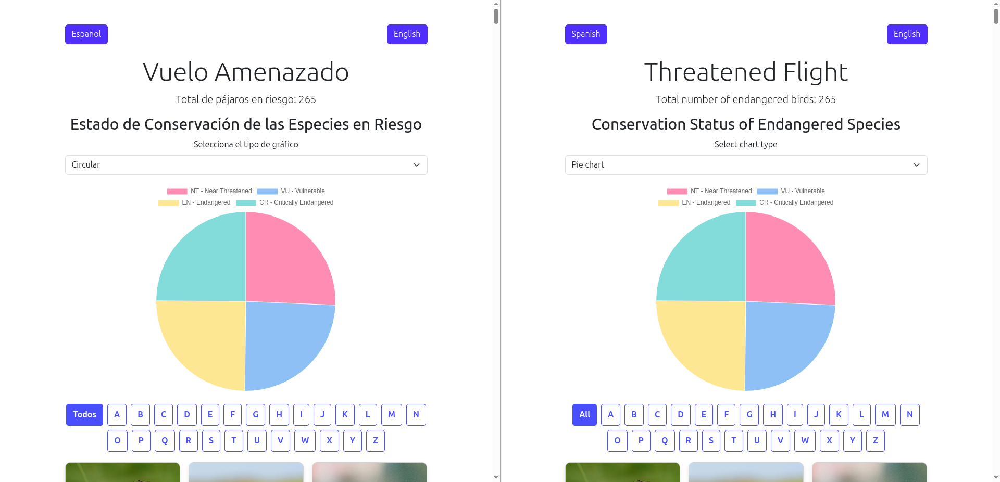


### Recuperar, añadir, editar y eliminar (Postman)
Se realizan las llamadas a la API utilizando Postman para comprobar su funcionamiento antes de la integración. No se incluyen imágenes de todas las pruebas, solo una muestra.

### GET

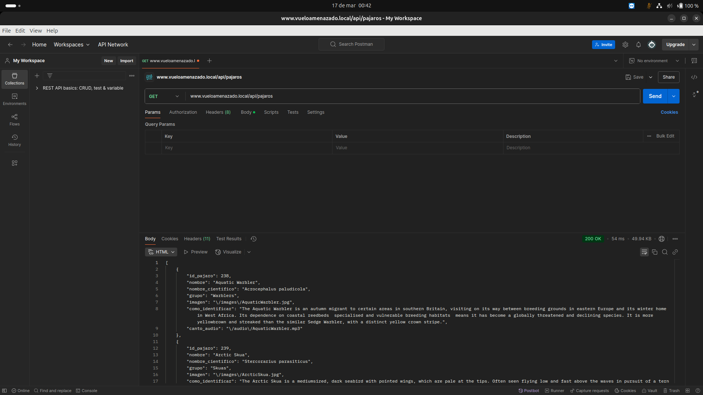

### POST

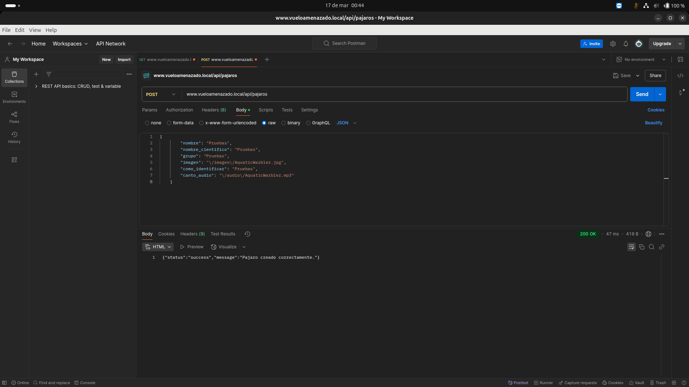

### PATCH

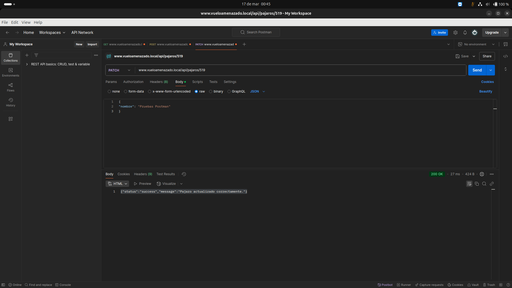

### DELETE

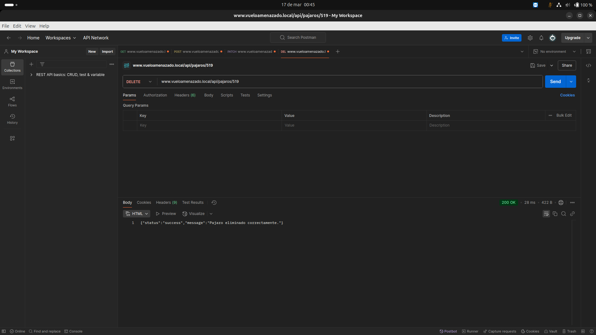

### Recuperar, añadir, editar y eliminar (web)
Se realizan las llamadas a la API utilizando la web para comprobar su funcionamiento después de la integración. No se incluyen imágenes de todas las pruebas, solo una muestra.

### Prueba GET
No se realizan pruebas, ya que la web muestra el contenido de forma satisfactoria.

### Estado antes de la prueba POST:

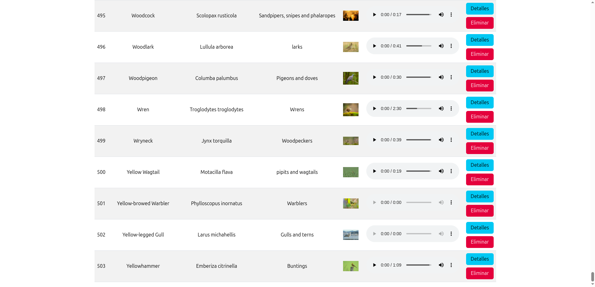

### Estado después de la prueba POST:
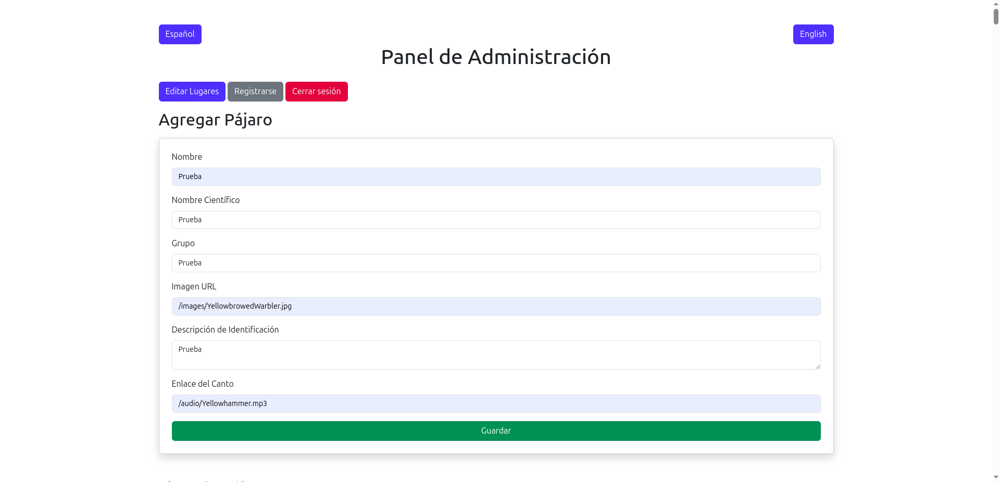

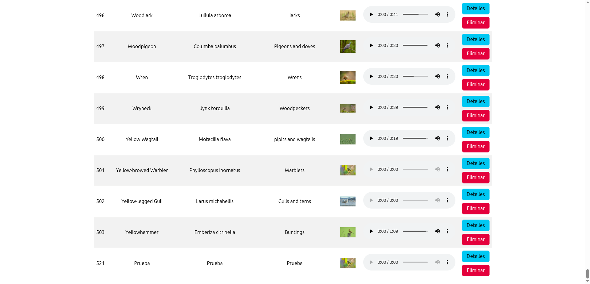

### Estado antes de la prueba PATCH:

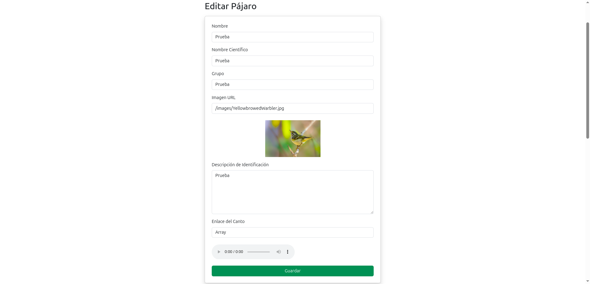

### Estado después de la prueba PATCH:

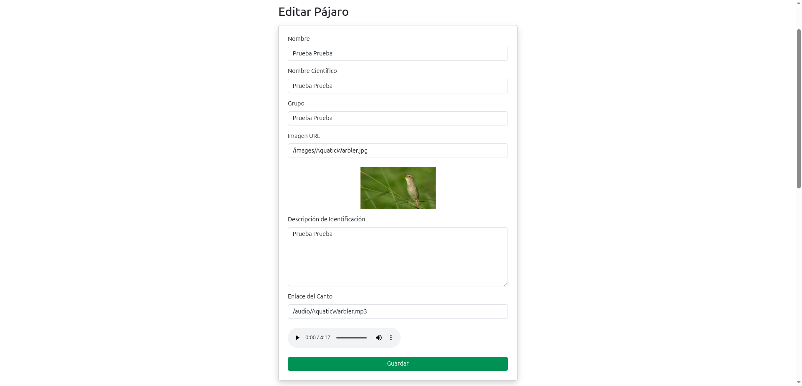

### Estado antes de la prueba DELETE:

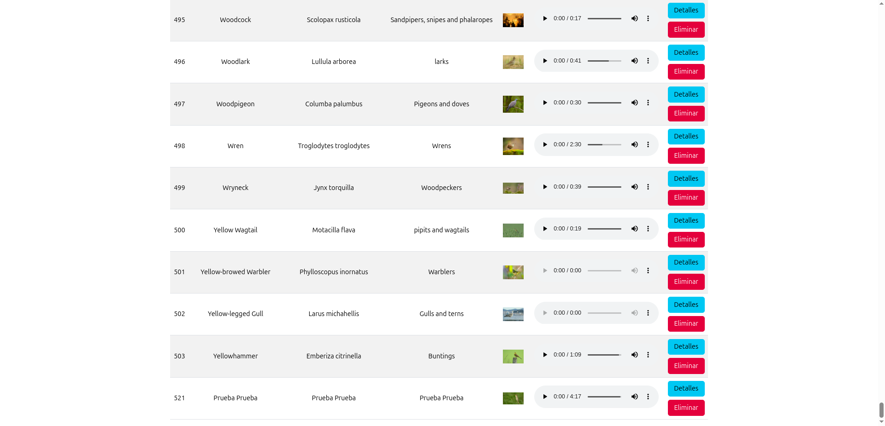

### Estado después de la prueba DELETE:

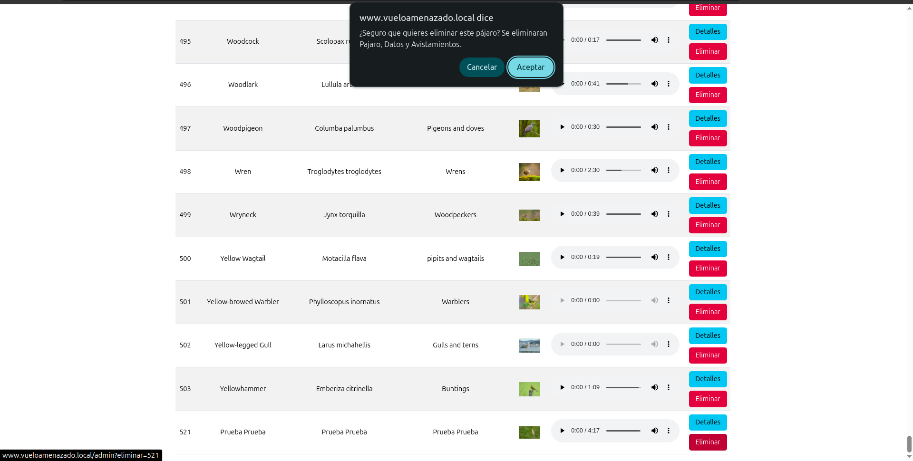


### Gestión de Sesiones y Cookies 

Se comprueba si el navegador almacena la cookie de la sesión

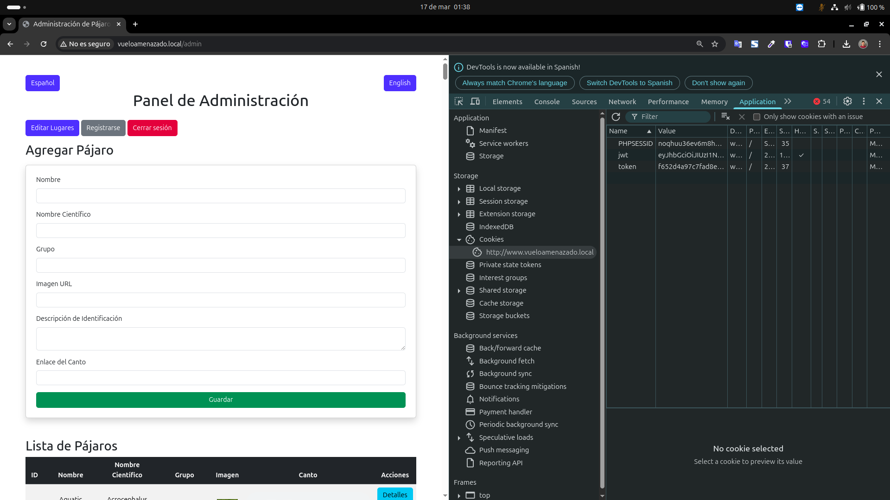

Se comprueba si el navegador elimina la cookie de la sesión

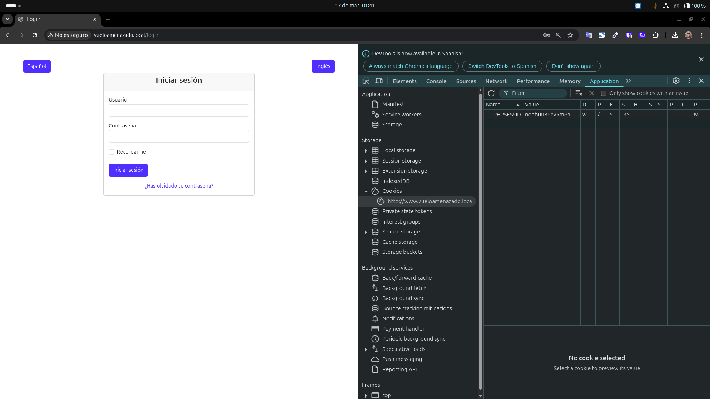

Se comprueba si se mantiene la sesión al abrir una ventana nueva del navegador

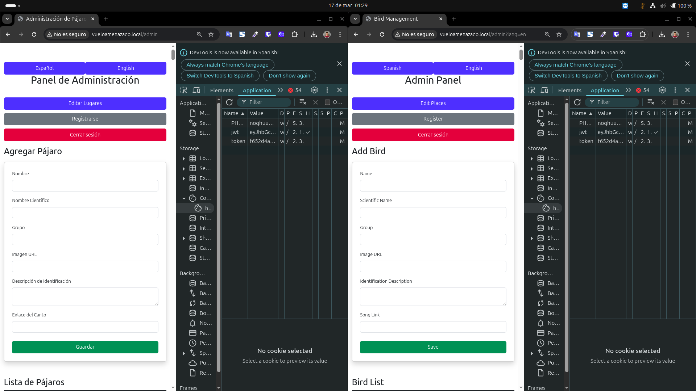

Se comprueba si se mantiene la sesión al abrir una ventana nueva del mismo navegador con otro perfil de Chrome

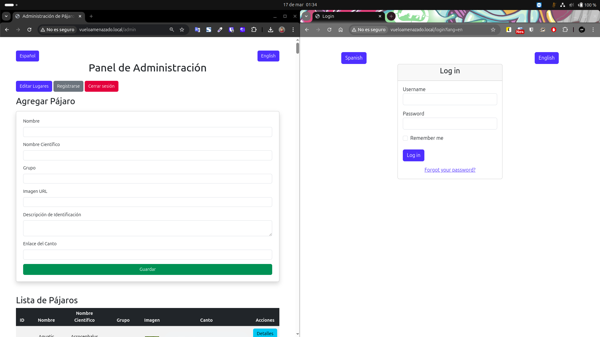

Se comprueba si se mantiene la sesión al abrir una ventana en otro navegador

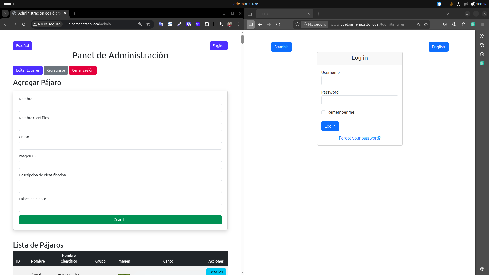

### Registro de usuarios

Se comprueba que se pueda registrar un usuario y se comprueba que no se pueda registrar un usuario que ya existe. No se realizan capturas.

### Interfaz adaptable
Vista en escritorio 1277px: Pantalla mayor a 1200px de ancho.

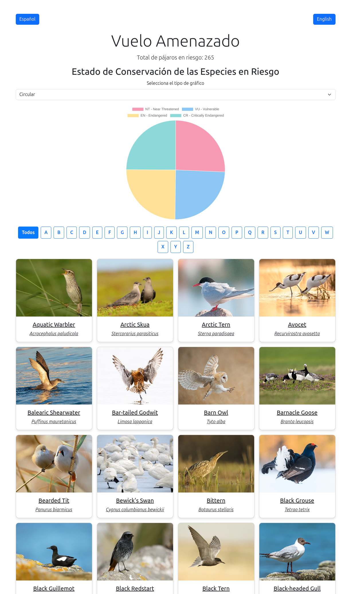

Vista en tablet 900px: Pantalla entre 768px y 1199px de ancho.

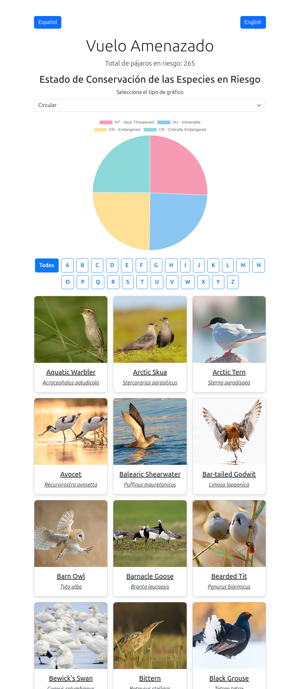

Vista en móvil 412px: Pantalla menor a 768px de ancho

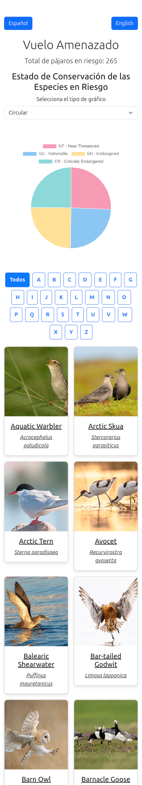


## Documentación
Se carece de documentación adicional, salvo por este README y los comentarios en el código. Debido a limitaciones de tiempo y recursos, no se pudo desarrollar una documentación más detallada. Sin embargo, se ha intentado que el código esté bien comentado para facilitar su comprensión y mantenimiento, asegurando que los desarrolladores puedan entender su funcionamiento de manera clara y directa.

## Mejoras
Aunque el proyecto cumple con las funcionalidades para la practica, existen varias áreas de mejora que podrían optimizar la experiencia de usuario y la eficiencia del sistema. Algunas posibles mejoras incluyen:

- **Pruebas automatizadas**: Implementar pruebas unitarias y de integración para asegurar la calidad del código y la estabilidad a largo plazo.

- **Optimización de rendimiento**: Mejorar el rendimiento de la carga de datos y las consultas a la base de datos para manejar un mayor volumen de información.

- **Interfaz de usuario**: Mejorar la accesibilidad y la experiencia de usuario, implementando un diseño más intuitivo y amigable.
Notificaciones y alertas: Agregar más notificaciones en tiempo real para la gestión de datos y alertas cuando se realicen cambios importantes.

- **Más funcionalidades**:
    - Implementar búsqueda por nombre.
    - Añadir paginación de resultados.
    - Permitir la eliminación de usuarios.
    - ~~Mejorar la seguridad restringiendo las llamadas a la API (intentado sin éxito).~~ ✅ Resuelto en mejoras post-práctica.

- **Documentación**: Desarrollar documentación funcional detallada.

- **API REST**: Optimizar las rutas y considerar separar la API en un proyecto independiente, lo que permitiría desacoplarla del front-end para una mayor flexibilidad y escalabilidad.

## Valoracion personal de la práctica
Desarrollar esta web me ha permitido experimentar el proceso completo de FullStack. La parte del Front-end, realizada con plantillas TWIG y Bootstrap, me ayudó a entender mejor cómo se gestionan los datos entre el frontend y el backend.

Configurar tanto Gettext como Twig fue un desafío, pero muy satisfactorio cuando finalmente funcionaron.

El desarrollo del backend y la API, separándola del frontend, me encantó. La tecnología API REST me impresionó mucho.

No conocía la seguridad web, y utilizar JWT me permitió aprender mucho, aunque me da rabia no haber logrado proteger las llamadas a la API sin autentificar.

En general, considero que he aprendido muchísimo y esta ha sido la práctica que más me ha gustado del Grado Superior en Desarrollo de Aplicaciones Web. Intentaré recuperar este proyecto y mejorarlo para incluirlo en mi portafolio.

## Nota obtenida de la práctica
10 /10

## Autores

- [@Fernandodg97](https://github.com/Fernandodg97)


## Licencia

[CC BY-NC-SA 4.0](https://creativecommons.org/licenses/by-nc-sa/4.0/deed.es)
